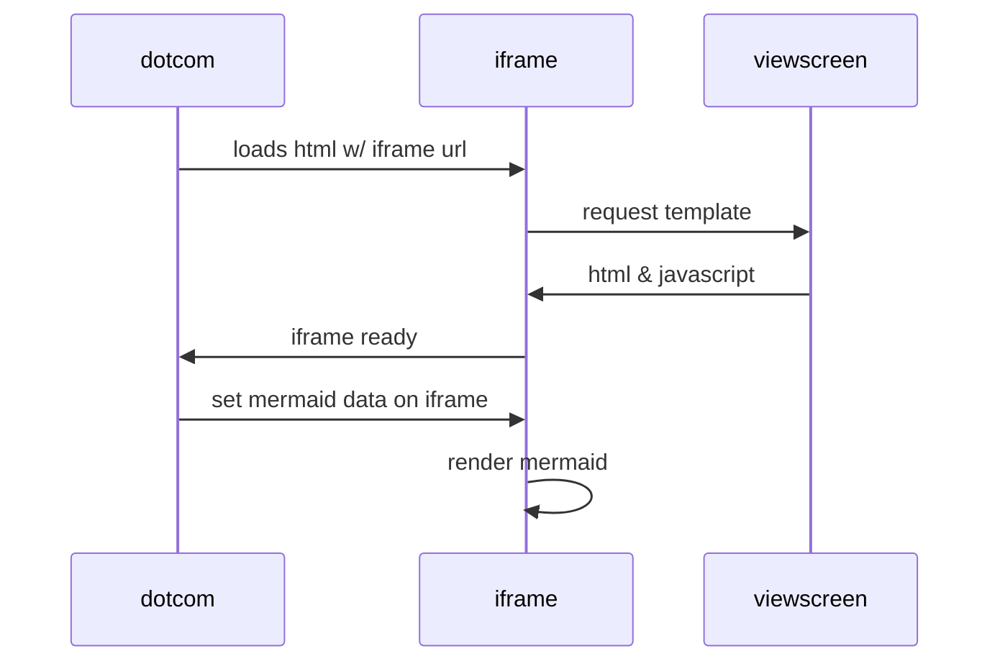

# learn_sf_agentforce
Repo containing stuff for Agentforce learning

Regular **Markdown** here.

<!--
@startmindmap
+ OS
++ Ubuntu [[https://google.com link]]
+++ Linux Mint
+++ Kubuntu
+++ Lubuntu
+++ KDE Neon
++ LMDE
++ SolydXK
++ SteamOS
++ Raspbian
-- Windows 95
-- Windows 98
-- Windows NT
--- Windows 8
--- Windows 10
@endmindmap
-->

Some more markdown. The above method of embedding Plantuml does not work, we need to use the custom GH action using [this plantuml-for-markdown](https://github.com/marketplace/actions/plantuml-for-markdown)

Try Mermaid embedded figure

